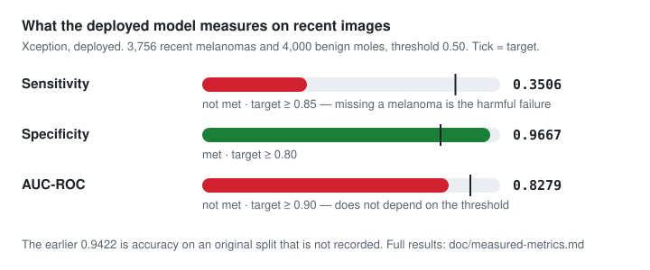

# MoleCare-ML

[](./LICENSE)
[](https://github.com/MoleCare/molecare-ml/actions/workflows/pr-checks.yml)
[](https://www.python.org)
[](./MODEL_CARD.md)
[](https://github.com/MoleCare/molecare-ml/issues/10)

Flask / TensorFlow service for **research and educational** mole-image analysis used by the [MoleCare](https://www.molecare.co.uk/) skin-health apps.

> **Not a medical device.** Predictions and ABCDE helpers are **not** diagnoses. Always seek care from a qualified clinician for concerning skin changes.

<p align="center">
  
</p>

<p align="center"><em>94% accuracy is the only thing that was measured. <a href="doc/94-percent-accurate.md">Why that means very little</a> · <a href="https://github.com/MoleCare/molecare-ml/issues/23">help measure the rest</a></em></p>

---

## Features

| Endpoint area | What it does |
|---------------|--------------|
| `/predict` | Melanoma vs not-melanoma score (baseline CNN) |
| `/analyze`, `/analyze/abcde` | Structured analysis + ABCDE-oriented CV signals |
| `/detect` | Lesion detection helpers |
| `/evolution` | Temporal comparison between images |
| `/predict-advanced`, `/compare-models` | Multi-model / premium paths (optional) |
| `/health` | Liveness |

Optional: Google [Derm Foundation](https://huggingface.co/google/derm-foundation) embeddings (gated model; requires Hugging Face token + acceptance of Google Health AI terms).

---

## Quick start (local)

Requires **Python 3.12+**.

```bash
python3 -m venv .venv
source .venv/bin/activate
pip install -r requirements.txt   # or requirements.lock for the exact pinned set

# Fetch the trained SavedModel (~88 MB, published as a GitHub Release asset)
scripts/fetch-model.sh
export MODEL_PATH=./cnn-models/xception/1
gunicorn --bind 0.0.0.0:5000 --timeout 300 wsgi
```

Docker:

```bash
scripts/fetch-model.sh                                  # weights are not in git
docker build -f deploy/Dockerfile.web -t molecare-ml .  # build from the repo root
docker run --rm -p 5000:5000 -e PORT=5000 molecare-ml
curl http://localhost:5000/health
```

There is no `Dockerfile` at the repository root — pass `-f` to pick one. `deploy/Dockerfile.web`
is the Flask service; `Dockerfile.lambda` builds the AWS Lambda container image instead.

Compose (nginx + serving + app) lives in `deploy/docker-compose.yml` and builds from the
repository root:

```bash
scripts/fetch-model.sh
docker compose -f deploy/docker-compose.yml up --build
```

Use localhost only; do not bake cloud credentials into images.

---

## Configuration (env only)

| Variable | Purpose |
|----------|---------|
| `MODEL_PATH` | Path to TensorFlow SavedModel |
| `PORT` | HTTP port (default 5000) |
| `HUGGINGFACE_TOKEN` | Optional Derm Foundation access |
| `WANDB_API_KEY` | Optional training logging |
| `AWS_*` | Optional deploy tooling — use IAM roles / local profile, **never** commit keys |
| `CORS_ALLOWED_ORIGINS` | Comma-separated origin allowlist. Defaults to localhost only — **set this in production** |
| `MAX_UPLOAD_MB` | Maximum request body size, default `10`. Oversized requests get a JSON `413` |
| `FLASK_DEBUG` | `1` enables the Werkzeug debugger. **Never set in production** — it permits arbitrary code execution |
| `FLASK_HOST` | Bind address for local runs, default `127.0.0.1` |

---

## Training (optional)

- Experiment notebooks live under `training-notebooks/`
- Metaflow flow: `flows/training_flow.py` (set your own S3 bucket via env/flags)
- Public derm datasets (e.g. Kaggle) have **their own licenses** — document provenance before redistributing weights or images

Do **not** commit `kaggle.json`, AWS keys, or patient photos.

---

## API sketch

```bash
# Health
curl -s http://localhost:5000/health

# Predict — JSON body, base64 image (NOT multipart)
curl -s -X POST http://localhost:5000/predict \
  -H 'Content-Type: application/json' \
  -d "{\"predictionid\":\"$(uuidgen)\",\"imagebase64\":\"$(base64 < sample.jpg | tr -d '\n')\"}"
```

`/predict` returns `melanomaProbability` (P(melanoma), 0-1). It also returns a deprecated
`percent` field which is P(**not** melanoma) as 0-100 — a high `percent` means low risk. Use
`melanomaProbability`.

See `ml_model_serving/` for route definitions and response schemas. Responses include a
non-diagnostic disclaimer.

---

## Models & licenses

| Component | Notes |
|-----------|--------|
| Xception / ImageNet-initialized Keras backbones | Follow TensorFlow / Keras license terms |
| Google Derm Foundation | [Terms](https://developers.google.com/health-ai-developer-foundations/terms); HF gated |
| Training data | Cite dataset sources (ISIC / HAM10000 / your Kaggle dataset) and redistribution rules |

Publish large weights via **GitHub Releases** or object storage — avoid committing multi‑MB binaries if possible.

---

## Training data and provenance

The models in this repository were trained on dermoscopic images from the
**[ISIC Archive](https://www.isic-archive.com/)** (International Skin Imaging Collaboration).
Sample images retained in `data/static/test_images/` carry their original ISIC identifiers
(for example `ISIC_0034074.jpg`).

**No MoleCare user or patient images are included in this repository or its history.**

ISIC Archive images are contributed under a range of licences (CC-0, CC-BY, CC-BY-NC) that vary
by contributing collection. If you intend to use the trained weights commercially, verify the
licence terms of the specific collections involved — a CC-BY-NC source restricts commercial
redistribution of derived artefacts. Attribution to the ISIC Archive is expected in all cases.

## Contributing

Contributions are welcome. **Start with [CONTRIBUTING.md](CONTRIBUTING.md)** — in particular the
`pre-commit install` step, which prevents credentials and notebook data from entering git history.

- [MODEL_CARD.md](MODEL_CARD.md) — what the model is, what was measured, and what was not
- [SECURITY.md](SECURITY.md) — reporting a vulnerability or a clinical-safety concern
- [Good first issues](https://github.com/MoleCare/MoleCare-ML/labels/good%20first%20issue)

The open problem we care most about is **performance across Fitzpatrick skin types**, which is
currently unmeasured. [Why our 94% accuracy number means very little](doc/94-percent-accurate.md)
explains what was and was not evaluated and why the gap matters; the work itself is tracked in
[issue #10](https://github.com/MoleCare/MoleCare-ML/issues/10). Results that make the model look
worse are as welcome as results that improve it.

## Intended use & limitations

- **Intended:** research, education, product prototyping behind MoleCare’s own clinical disclaimers
- **Not intended:** autonomous diagnosis, triage without a clinician, or regulatory claims
- Performance varies by skin type, lighting, image quality, and dataset bias — evaluate before any production use

---

## Security

- Never commit PEM files, AWS keys, or `.env`
- Rotate any credential that ever appeared in git history
- Keep nested product docs / runbooks out of this repository

See the MoleCare DevBox doc: `docs/OPEN_SOURCE_SANITIZE_CHECKLIST.md`.

---

## Related

- [MoleCare](https://www.molecare.co.uk/)
- MoleCare MCP server (assistant / ops tools)
- Mobile apps on [App Store](https://apps.apple.com/us/app/molecare/id1448635328) and [Google Play](https://play.google.com/store/apps/details?id=com.mymolecare)

---

## Contributors

Thank you to everyone who has helped molecare-ml.

<!-- readme: contributors,bots/- -start -->
<p align="center">
  <a href="https://github.com/YauhenBichel" title="Yauhen Bichel" aria-label="Yauhen Bichel"></a>
</p>
<!-- readme: contributors,bots/- -end -->

The list is filled by [Contributors](./.github/workflows/contributors.yml) from
GitHub commits, bots omitted — never hand-maintained, because a stale list is
worse than none. [Contributor graph](https://github.com/MoleCare/molecare-ml/graphs/contributors) ·
[good first issue](https://github.com/MoleCare/molecare-ml/labels/good%20first%20issue)

## License

Licensed under the [Apache License 2.0](LICENSE).

Third-party model and dataset licences still apply and are **not** granted by this licence — see
[Training data and provenance](#training-data-and-provenance) below.

---

## Contributors

Thank you to everyone who has helped this project.

<!-- readme: contributors,bots/- -start -->
<!-- readme: contributors,bots/- -end -->

The list is filled by GitHub Actions from commits (bots omitted). [Contributor graph](https://github.com/MoleCare/MoleCare-ML/graphs/contributors)
